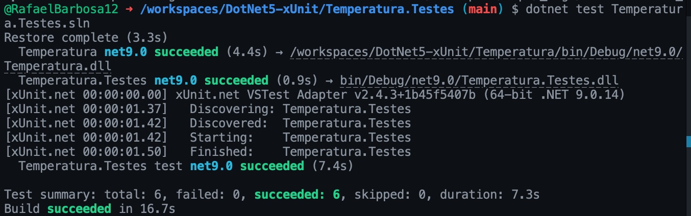
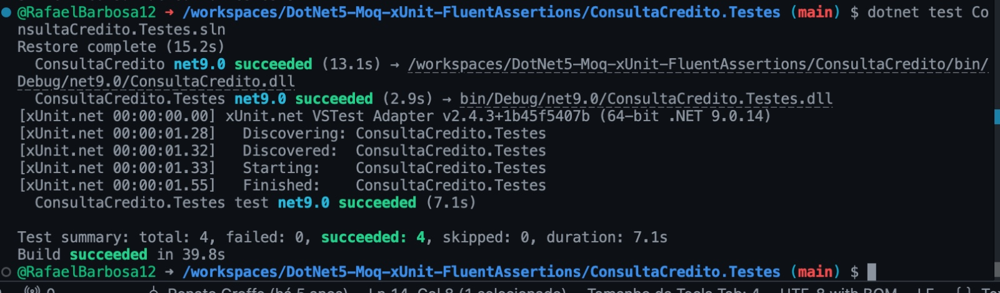
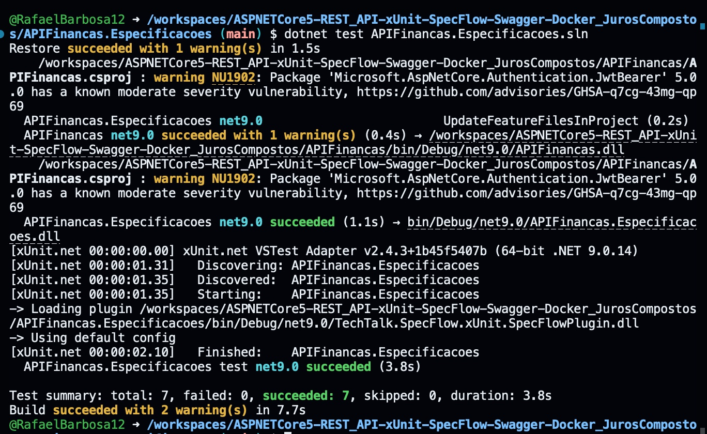

 

  Figura 1 — Execução dos testes (Temperatura.Testes, xUnit)   
  
    
  Fonte: elaborado pelos autores. Projeto DotNet5-xUnit; `dotnet test` no Codespace.

 

A estrutura é dividida em três partes. O arquivo de testes Temperatura.Testes/TestesConversorTemperatura.cs#L1-L100 define os cenários usando xUnit com [Theory] e múltiplos [InlineData], cada um fornecendo a entrada (fahrenheit) e a saída esperada (celsius).

Os passos/implementação dos testes estão em Temperatura.Testes/TestesConversorTemperatura.cs#L1-L100: o método TestarConversaoTemperatura(double fahrenheit, double celsius) recebe os parâmetros dos InlineData, chama ConversorTemperatura.FahrenheitParaCelsius(fahrenheit) e valida o resultado com Assert.Equal.

A regra de negócio usada pelos testes está em Temperatura/ConversorTemperatura.cs#L1-L50, que converte Fahrenheit para Celsius pela fórmula (temperatura - 32) / 1.8 e retorna o valor arredondado para 2 casas decimais via Math.Round(..., 2).

 

  Figura 2 — Execução dos testes (ConsultaCredito.Testes, xUnit + Moq + FluentAssertions)   
  
    
  Fonte: elaborado pelos autores. Projeto DotNet5-Moq-xUnit-FluentAssertions; `dotnet test` no Codespace.

 

A estrutura é dividida em três partes. O arquivo ConsultaCredito.Testes/TestesAnaliseCredito.cs define os quatro cenários com xUnit ([Fact]), usando Moq para simular o serviço externo IServicoConsultaCredito: CPF inválido, erro de comunicação, CPF sem pendências e CPF inadimplente.

Os passos/implementação dos testes estão no mesmo TestesAnaliseCredito.cs: no construtor o mock configura o retorno de ConsultarPendenciasPorCPF para cada CPF; cada teste chama AnaliseCredito.ConsultarSituacaoCPF e valida o status com FluentAssertions (Should().Be(...)).

A regra de negócio usada pelos testes está em ConsultaCredito/AnaliseCredito.cs, que consulta o serviço de crédito e devolve o enum StatusConsultaCredito (parâmetro inválido, erro de comunicação, sem pendências ou inadimplente) conforme a resposta obtida.

 

  Figura 3 — Execução dos testes (APIFinancas.Especificacoes, xUnit + SpecFlow)   
  
    
  Fonte: elaborado pelos autores. Projeto ASPNETCore5-REST_API-xUnit-SpecFlow-Swagger-Docker; `dotnet test` no Codespace.

 

O cálculo de juros compostos foi ajustado para arredondar o valor final para 2 casas decimais antes de devolver o resultado.
Antes, o método retornava o número bruto com várias casas e os cenários esperavam já formatado.

A estrutura é dividida em três partes. O arquivo CalculoJurosCompostos.feature define os cenários em Gherkin, cada um com entrada de valor, meses e taxa, e a saída esperada.

Os passos do Gherkin são implementados em CalculoJurosCompostosStepDefinition.cs: os métodos anotados com Given, When e Then capturam os dados, chamam o cálculo e fazem a validação final com Assert.Equal.

A regra de negócio usada pelos testes está em CalculoFinanceiro.cs, que calcula juros compostos com Math.Pow e agora arredonda o resultado para 2 casas decimais.

